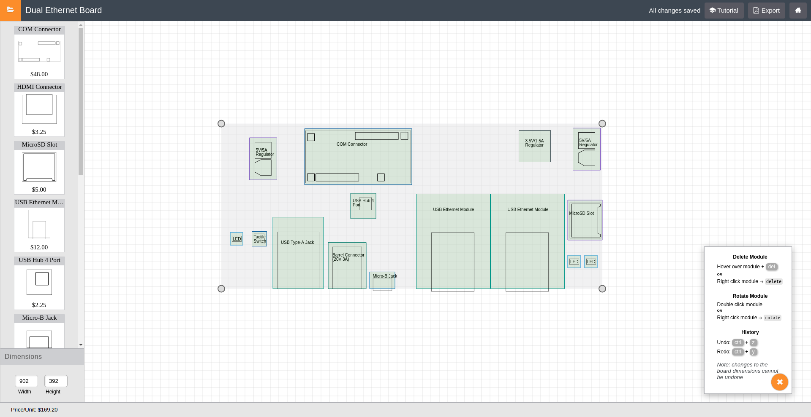

PCB Flow
=================


## Live App
https://pcbflow.haydenhw.com/

## Summary
A drag and drop tool for designing electronic devices. Tailored specifically
to make electronics design accessible and approachable for non-engineers.

## Technologies
* React
* Redux
* React-Konva
* SCSS
* Node
* Express
* Knex
* PostgreSQL
* Mocha
* Heroku

API Docs
=================

## Get projects 

<strong>GET /api/projects</strong>

Successful response
```json
[
  {
    "id": 9,
    "user_id": "SJ9M3oy9U",
    "name": "Example Project",
    "is_sample_project": true,
    "board": {
      "height": 315,
      "width": 448,
      "x": 341.5,
      "y": 285
    },
    "modules": [
      {
        "id": 50,
        "project_id": 9,
        "module_id": "105",
        "price": 48,
        "icon_height": "70px",
        "icon_src": "images/COM-connector.svg",
        "image_src": "images/COM-connector.svg",
        "image_height": 125,
        "image_width": 250,
        "image_y": 4,
        "image_x": 2,
        "text_y": 32,
        "text_x": 76,
        "text": "COM Connector",
        "inner_group_y": -60.5,
        "inner_group_x": 193.5,
        "bound_to_side_index": null,
        "rotation": 90,
        "height": 133,
        "width": 254,
        "stroke": "#01579b",
        "y": 110.5,
        "x": 124.5,
        "dependencies": [
          "109"
        ]
      },
      {
        "id": 51,
        "project_id": 9,
        "module_id": "109",
        "price": 9.75,
        "icon_height": "70px",
        "icon_src": "images/regulator-5V5A-icon.svg",
        "image_src": "images/regulator-5V5A.svg",
        "image_height": 80,
        "image_width": 40,
        "image_y": 10,
        "image_x": 12.5,
        "text_y": 25,
        "text_x": 15,
        "text": "5V/5A Regulator",
        "inner_group_y": 17.5,
        "inner_group_x": 82.5,
        "bound_to_side_index": null,
        "rotation": 90,
        "height": 100,
        "width": 65,
        "stroke": "#7e57c2",
        "y": 93,
        "x": 23,
        "dependencies": [
          "110"
        ]
      }
    ]
  },
  {
    "id": 10,
    "user_id": "SJ9M3oy9U",
    "name": "Untitled",
    "is_sample_project": false,
    "board": {
      "height": 300,
      "width": 500,
      "x": 261,
      "y": 220
    },
    "modules": [
      {
        "id": 58,
        "project_id": 10,
        "module_id": "105",
        "price": 48,
        "icon_height": "70px",
        "icon_src": "images/COM-connector.svg",
        "image_src": "images/COM-connector.svg",
        "image_height": 125,
        "image_width": 250,
        "image_y": 4,
        "image_x": 2,
        "text_y": 32,
        "text_x": 76,
        "text": "COM Connector",
        "inner_group_y": 0,
        "inner_group_x": 0,
        "bound_to_side_index": null,
        "rotation": 0,
        "height": 133,
        "width": 254,
        "stroke": "#01579b",
        "y": 34.5,
        "x": 44,
        "dependencies": [
          "109"
        ]
      }
    ]
  }
]
```

## Create project 
<strong>POST /api/projects</strong>

Example request body
```json 
{
  "user_id": "SJ9M3oy9U",
  "name": "New Project",
  "board_specs": {
    "height": 300,
    "width": 500,
    "x": 162,
    "y": 220
  },
  "modules": []
}
```

## Update project 
<strong>PATCH /api/projects/:projectId</strong>

Example request body
```json
{ 
    "name": "Updated Project Name"
}
```
## Delete project 
<strong>DELETE /api/projects/:projectId</strong>

Modules
=================

## Create module 
<strong>POST /api/modules</strong>

Example request body
```json 
{
    "id": 58,
    "project_id": 10,
    "module_id": "105",
    "price": 48,
    "icon_height": "70px",
    "icon_src": "images/COM-connector.svg",
    "image_src": "images/COM-connector.svg",
    "image_height": 125,
    "image_width": 250,
    "image_y": 4,
    "image_x": 2,
    "text_y": 32,
    "text_x": 76,
    "text": "COM Connector",
    "inner_group_y": 0,
    "inner_group_x": 0,
    "bound_to_side_index": null,
    "rotation": 0,
    "height": 133,
    "width": 254,
    "stroke": "#01579b",
    "y": 34.5,
    "x": 44,
    "dependencies": [
      "109"
    ]
}
```

## Update module 
<strong>PATCH /api/modules/:moduleId</strong>

Example request body
```json
{ 
    "y": 34.5,
    "x": 44
}
```
## Delete module 
<strong>DELETE /api/modules/:moduleId</strong>
